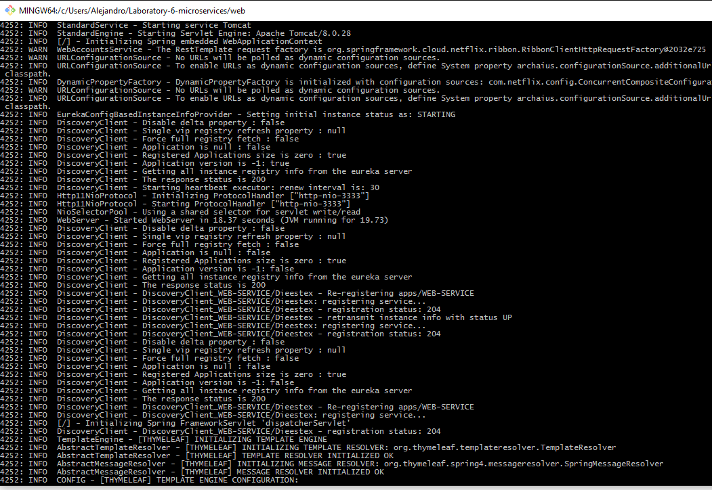
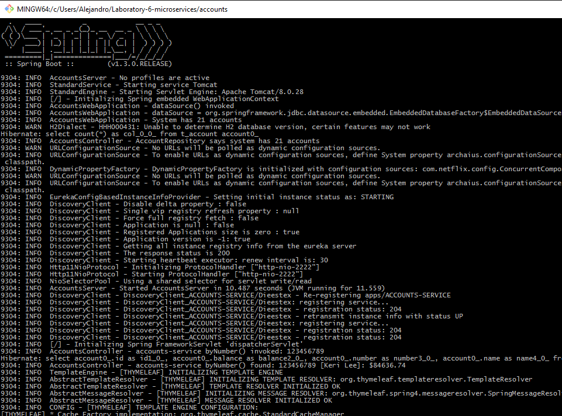
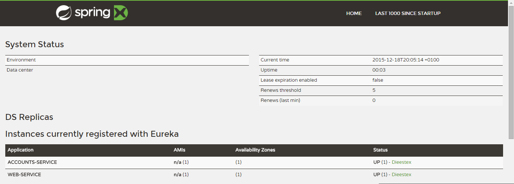
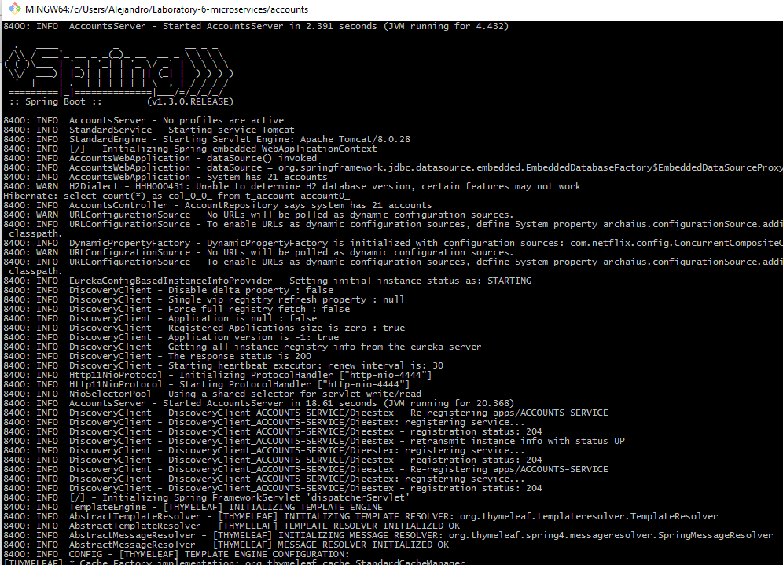

# Web Engineering 2015-2016 / Microservices
Please, go to the [Wiki](https://github.com/UNIZAR-30246-WebEngineering/Laboratory-6-microservices/wiki) in order to get the instructions for this assignment.

# The two microservices are running and registered

# The service registration service has the two microservices registered

# A second account microservice is running in the port 4444 and it is registered

# A brief report describing what happens when you kill the microservice with port 2222

When we kill microservice in p 2222 the web service stop providing information about accounts becouse the micro service is down. 
But after a few seconds, the registration service detects that and detects that there is another service registered in port 4444.
And when the web service ask the registration service for another account service, it provides the service in port 4444. So the web service can provide information about accounts again.
